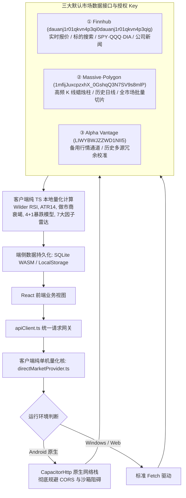

# 🚀 StockScanner V6.5 美股量化 AI 扫描与异动预警系统 · 项目交接文档与系统提示词 (Handoff Prompt)

> **版本状态**：V6.08 Release (2026年10月)  
> **核心定位**：跨平台（Windows 桌面端 + Android 原生手机端）高频美股量化选股扫描、多因子雷达、暴跌抄底反弹预警与交易决策终端。  
> **单机独立架构**：Windows 版本与 Android 版本均**100% 采用纯单机模式 (Standalone Mode)**，彻底废弃“服务端中继模式”。所有实时行情拉取、量化因子计算、Wilder RSI、ATR14、做市商衰竭评估、暴跌 4+1 模型、条件预警均在客户端本地（`directMarketProvider.ts` + SQLite WASM）独立闭环运行。  
> **默认权威数据源**：默认内置三大官方市场数据接口与授权 Key（Finnhub, Massive, Alpha Vantage），支持多源自动故障转移与毫秒级降级自愈。

---

## 一、 系统全景架构与技术栈

| 层次 | 技术选型与实现 |
| :--- | :--- |
| **前端展现** | React 19.0.1, TypeScript 7.0.2, Tailwind CSS v4.3.3, Lucide React, Google Material 3 (M3) 规范 |
| **桌面端** | Electron 44.5.1, Electron-Builder, 纯单机独立运行, 系统托盘守护与原生通知 (Action Center) |
| **移动端** | Capacitor 8.5.2, Android 原生框架 (compileSdk 36, minSdk 24, targetSdk 36), 纯单机独立运行 |
| **数据与计算引擎** | **100% 纯客户端单机量化引擎**：<br>① `directMarketProvider.ts`：纯客户端多因子量化运算 + SQLite WASM<br>② 默认直连 3 大官方数据源：Finnhub、Massive (Polygon)、Alpha Vantage<br>③ 彻底不依赖外部 Node.js 服务端中继，全本地闭环 |
| **打包与交付** | 严格单文件发布策略：`release/StockScanner V{Version}.apk`，每次打包自增 0.01 并自动清理旧版 APK |
| **测试验证体系** | `tests/terminal.test.ts`（包含 53 项大型金融/量化/跨平台集成测试，当前通过率 **100% (53/53)**） |

---

## 二、 核心业务模块与最新实现细节

### 1. 暴跌反弹预警引擎 (Plunge & Rebound Hub)
- **4+1 核心量化模型**：
  1. `CONNORS_RSI`：经典康纳斯 RSI 深度超卖均值回归
  2. `WYCKOFF_CLIMAX`：威科夫恐慌抛售高潮与卖压衰竭
  3. `VWAP_DEVIATION`：机构成交量加权均线极端负向偏离
  4. `BOLLINGER_EXTREME`：布林极限带下轨触底反弹
  5. `CUSTOM`：用户自定义多因子参数模型
- **自适应防飞刀过滤 (Anti-Falling-Knife Adaptive Filter)**：
  - 动态跟踪 VIX 恐慌指数与大盘 SPY 状态，动态调节跌幅门槛乘数（1.0x ~ 1.5x），避免大盘崩盘时盲目抄底。
- **做市商衰竭信号与 OCO 括号单**：
  - 自动输出做市商抛售衰竭指标，自动计算买入价、止盈目标价（+1.0% ~ +2.5%）与防守止损价（-1.0%）。

### 2. 量化策略库 (Quantitative Strategy Hub)
- **4 大差异化量化选股策略**（彻底杜绝雷达克隆数据）：
  - 策略 1：流动性猎手 (Liquidity Sweep)
  - 策略 2：机构突破 (Institutional Breakout)
  - 策略 3：极度恐慌均值回归 (Extreme Panic Reversion)
  - 策略 4：弱势动量做空 (Bearish Momentum Short)
- **UI 规范**：全美股扫描按钮文案统一为 **「扫描美股」**。

### 3. 全景宏观看板与核心板块轮动 (Market Dashboard & Sector Rotation)
- **拒绝任何模拟数据，已 100% 接通真实云端 API**：
  - **大盘指数**：Finnhub 实时抓取 `SPY`、`QQQ`、`DIA`；
  - **恐慌指数**：Yahoo Finance 权威抓取 `^VIX`（点位实测 `15.08` 真实波动）；
  - **动态环境评级**：`VIX < 18` 判定为多头进攻 (Risk-On)，`18~25` 判定为中性震荡，`>= 25` 判定为避险防守；
  - **8 大核心板块**：实时抓取科技 `XLK`、半导体 `SOXX`、通信 `XLC`、消费 `XLY`、金融 `XLF`、医疗 `XLV`、工业军工 `XLI`、能源 `XLE`；
  - **相对强弱**：动态推算板块相对 SPY 的超额收益率（Relative Strength）。
  - **一键实时刷新**：支持穿透 30 秒防刷缓存，强制获取分秒级真实云端数据。

### 4. 浮岛预警弹窗 (LiveAlertBanner - Google M3 Dynamic Island)
- **超轻量单行胶囊设计**：高度压缩至 **38px**（释放 78% 屏幕空间），彻底解决遮挡问题。
- **流式组件排布**：呼吸脉冲灯 + 股票代码 + 跌幅 + 模型标签 + **【🎯 定位】** 药丸 + 历史气泡计数 + 关闭。
- **半屏抽屉式底栏 (M3 Modal Bottom Sheet)**：点击历史气泡即滑出抽屉，完整查看止损止盈与 K 线入口。

### 5. Android 后台常驻通讯与微信级浮动弹窗预警系统 (Foreground Service & Heads-Up Alert)
- **原生保活服务 (`StockScannerForegroundService.java`)**：
  - 声明 `FOREGROUND_SERVICE`、`WAKE_LOCK`、`POST_NOTIFICATIONS`；
  - 通知栏常驻安静守护通知（`🛡️ StockScanner 美股AI雷达监控中`），持有 `PARTIAL_WAKE_LOCK` 阻止 CPU 深度休眠；
  - 切到微信、刷其他 App 或息屏锁屏时，后台扫描均持续运转。
- **微信级顶端悬浮横幅弹窗 (`stockscanner_alerts_channel`)**：
  - 重要性等级 `IMPORTANCE_HIGH`，优先级 `PRIORITY_MAX`，配置声音与震动；
  - 触发预警时，在屏幕顶端弹出类似微信新消息的浮动横幅卡片，点击即拉起 App 并锚定到对应股票。
- **驻留开关控制面板**：
  - 暴跌反弹页面与设置页面均提供【后台通讯与预警常驻守护】开关；
  - 频率切换：15秒(极速) / 30秒(推荐) / 1分钟 / 5分钟；
  - 一键跳转手机系统「电池无限制运行」白名单设置。

### 6. 精美 Android 图标设计 (Google Material 3)
- **矢量自适应图标**：
  - 背景：Google 极客深空蓝（`#0D1B2A`，`ic_launcher_background.xml`）；
  - 前景：Google 经典色彩体系（黄 `#FBBC04`、蓝 `#4285F4`、绿 `#34A853`、红 `#EA4335`），由上升 K 线、AI 雷达扫描光波与预警四角星芒构成（`ic_launcher_foreground.xml`）；
  - 适配任意 Android 启动器裁剪，桌面显示名称规范为 **`StockScanner`**。

---

## 三、 关键代码拓扑与文件分布

### 1. 移动原生层 (Android Native Bridge)
```
android/app/src/main/
├── java/com/v65/android/
│   ├── MainActivity.java                   # Capacitor 主承载入口
│   ├── BackgroundAlertPlugin.java          # 前台保活与微信级浮动横幅 Capacitor 插件
│   └── StockScannerForegroundService.java  # 原生保活服务、双通知渠道、WakeLock 守护
├── AndroidManifest.xml                    # 权限声明 (WAKE_LOCK, FOREGROUND_SERVICE, POST_NOTIFICATIONS)
└── res/drawable/
    ├── ic_launcher_background.xml          # 极客深空蓝 #0D1B2A
    └── ic_launcher_foreground.xml          # Google 经典四色 K线/雷达/星芒矢量图
```

### 2. 客户端服务与核心引擎层 (`src/services/`)
```
src/services/
├── apiClient.ts                # 统一前端数据网关，双轨路由智能中继/脱机分发
├── directMarketProvider.ts     # 客户端纯本地量化直连引擎 (零 Node 依赖，CapacitorHttp 原生加速)
├── notificationService.ts      # 跨端预警事件总线、音频和弦引擎与悬浮窗触发
├── backgroundAlertService.ts   # 前台保活服务 TypeScript 桥接层与轮询配置持久化
└── websocketClient.ts          # 桌面局域网中继模式下的微秒级 WebSocket 流式客户端
```

### 3. 前端交互与视图组件 (`src/views/` & `src/components/`)
```
src/
├── views/
│   ├── PlungeReboundView.tsx       # 暴跌反弹预警中心 (4+1 模型、防飞刀过滤、保活开关)
│   ├── RadarScannerView.tsx        # 多因子雷达扫描器 (7 大因子共振、板块深度筛选)
│   ├── QuantStrategyView.tsx       # 量化策略库 (4 大差异化策略，杜绝雷达数据克隆)
│   ├── MarketDashboardView.tsx     # 全景宏观看板 (真实 Finnhub SPY/QQQ/DIA + Yahoo ^VIX + 8 大板块)
│   ├── WatchlistAndAlertsView.tsx  # 自选股与条件预警看板 (富途/TradingView 紧凑交互)
│   ├── StockDetailView.tsx         # 个股详情 (微观流动性、OCO 括号单、多周期 K 线)
│   └── SettingsView.tsx            # 系统设置 (API 测试、局域网配置、保活电池白名单)
├── components/
│   ├── alerts/
│   │   └── LiveAlertBanner.tsx     # M3 灵动悬浮预警胶囊 (38px 紧凑设计，一键定位，历史抽屉)
│   └── m3/                         # Google Material 3 基础套件
│       ├── M3ModalBottomSheet.tsx  # 抽屉式半屏浮动底栏 (防遮挡)
│       ├── M3SegmentedButton.tsx   # 分段胶囊控制按钮
│       ├── M3SliderStepper.tsx     # 阈值微调步进滑动器
│       ├── ReboundParameterSheet.tsx       # 暴跌模型独立参数配置抽屉
│       └── ReboundCandidateDetailSheet.tsx # 暴跌个股做市商衰竭与 OCO 决策抽屉
```

### 4. 服务端中继与服务端量化核 (`server/`)
```
server/
├── server.ts                   # Express + HTTP + WebSocket 服务端入口
├── quant/
│   ├── indicators.ts           # Wilder 平滑 RSI 算法、ATR14、RVOL 指标
│   ├── rebound/                # 暴跌 4 大模型服务端实现
│   ├── strategies/             # 72+ 量化策略库与分类检索系统
│   ├── backtest/               # 蒙特卡洛 1,000 次自举压力测试、VaR/CVaR 引擎
│   └── risk/noTradeArbitrator.ts # 交易风险仲裁器与 5% 硬止损天花板
└── services/
    ├── marketDataProvider.ts   # 真实行情抓取与多 API 故障降级熔断器
    ├── reboundScannerDaemon.ts # 服务端盘中暴跌反弹高频轮询守护
    ├── alertEngine.ts          # 条件预警触发引擎
    └── websocketServer.ts      # 局域网广播 WebSocket 服务
```

### 5. 构建与自动化流水线 (`scripts/`)
```
scripts/
├── build-android.js    # Android 自动化编译与单文件发布流水线 (自增 0.01，清理旧包)
├── build-desktop.js    # Electron-Builder 桌面端打包流水线
└── build.js            # 综合前后端构建入口
```

---

## 四、 纯单机架构与三大默认数据接口规范 (100% Standalone Architecture)

系统全面确立 **100% 纯客户端单机运行规范**，Windows 桌面端与 Android 手机端彻底废弃“服务端中继模式”，不依赖任何外部中继服务，所有量化计算与预警均在端侧本地闭环完成：



### 1. 三大默认权威数据接口职责与授权 Key
1. **Finnhub (`dauanj1r01qkvn4p3qi0dauanj1r01qkvn4p3qig`)**：
   - 承担秒级实时买卖报价、全美股代码搜索、三大核心指数 (SPY, QQQ, DIA) 宏观跟踪与公司实时新闻资讯。
2. **Massive / Polygon 协议 (`1mfijJuxcpzxhX_0GshqQ3N7SV9s8mlP`)**：
   - 承担高频盘中分时蜡烛柱、跨周期历史 K 线、全美股暴跌候选批量筛选与流动性切片。
3. **Alpha Vantage (`LIWYBWJZZWD1NII5`)**：
   - 作为高可用备用数据通道，提供技术指标交叉验证与历史多周期数据冗余支撑。

### 2. 客户端纯独立单机量化计算能力
- **零 Node 服务端依赖**：`directMarketProvider.ts` 内置完备的现代数学与金融量化库，无需依赖外部服务器，单机即可本地独立计算：
  - Wilder 14 周期指数平滑 RSI；
  - 14 日 ATR 真实波动幅度；
  - RVOL 相对成交量倍数；
  - 康纳斯 RSI (Connors RSI)、威科夫恐慌抛售高潮 (Wyckoff Climax)、VWAP 偏离度、布林极限带 (Bollinger Extreme)；
  - 做市商抛售衰竭指数与自动 OCO 括号买卖点计算。
- **美东交易时区时钟 (`sessionClock`)**：脱机环境下自动判断当前美股处于【盘前】、【盘中】、【盘后】或【休市】阶段。
- **多源自动故障转移 (Auto Failover)**：当主接口遇到网络阻塞或频控限制 (HTTP 429) 时，客户端自动毫秒级切换至备用接口，平滑过渡，杜绝客户端白屏或崩溃。

---

## 五、 Android 原生保活与微信级浮动预警系统

针对移动交易者切屏、熄屏导致预警中断的痛点，设计了深度结合 Android 原生底层能力的后台守护方案：

### 1. 双通知渠道隔离机制
1. **`stockscanner_daemon_channel` (常驻保活渠道)**：
   - 渠道属性：`IMPORTANCE_LOW`（安静模式，不产生震动与声音打扰）。
   - 通知表现：`🛡️ StockScanner 美股AI雷达监控中 | 扫描周期: 30秒`，带有最新心跳时间戳，持续占据通知栏守护进程。
   - 底层机制：在 `onStartCommand` 中调用 `startForeground`，并持有 CPU `PARTIAL_WAKE_LOCK`，确保息屏状态下 CPU 持续执行盘中高频量化扫描。
2. **`stockscanner_alerts_channel` (微信级浮动横幅渠道)**：
   - 渠道属性：`IMPORTANCE_HIGH`，优先级 `PRIORITY_MAX`。
   - 交互表现：一旦触发暴跌抄底或核心异动信号，立即从屏幕顶部下弹**浮动卡片横幅 (Heads-Up Banner)**，附带专属和弦提示音与强震动。
   - 深度拉起跳转：点击横幅直接拉起 `MainActivity`，并携带股票代码参数瞬间锚定至目标股详情页或买入决策点。

### 2. 电池优化白名单直通车
- 提供一键跳转系统电池优化设置接口 (`requestBatteryOptimizationExemption`)，引导用户将 StockScanner 加入「无限制运行」白名单，彻底免疫各大厂商系统的后台查杀。

---

## 六、 桌面端架构与系统托盘体系 (Desktop Architecture)

桌面端基于 **Electron 44.5.1** 构建，具备商业级交易终端的系统驻留与守护能力：

1. **子进程生命周期编排 (`main.js`)**：
   - 启动时自动拉起后台 Node 量化微服务中继 (`server.ts` / `server.cjs`)；
   - 建立健康检查轮询 (`/api/health`)，API 就绪后自动展示前端主窗口；
   - 退出应用时自动安全释放端口，清理并终结子进程，杜绝孤儿子进程残留。
2. **商业级系统托盘 (System Tray)**：
   - Windows 任务栏通知区常驻专属量化图标；
   - 托盘右键菜单支持：一键唤醒终端、实时引擎状态监控、快速静音与彻底退出；
   - 支持关闭行为首选项：最小化到系统托盘 (MINIMIZE_TO_TRAY) 或直接退出。
3. **原生通知气泡 (Tray Balloon / Action Center)**：
   - 盘中捕捉到核心标的异动时，通过 Windows 原生通知气泡向系统操作中心推送快讯。

---

## 七、 核心量化算法与指标标准

### 1. 严格 Wilder RSI 14 周期计算契约
公式严格遵循 J. Welles Wilder 原著定义的指数平滑算法，彻底杜绝传统简单平均 (SMA) 导致的滞后与失真：
$$\text{Smoothed Gain}_t = \frac{\text{Prior Gain} \times (n - 1) + \text{Current Gain}}{n}$$
$$\text{Smoothed Loss}_t = \frac{\text{Prior Loss} \times (n - 1) + \text{Current Loss}}{n}$$
$$\text{RS} = \frac{\text{Smoothed Gain}}{\text{Smoothed Loss}}, \quad \text{RSI} = 100 - \frac{100}{1 + \text{RS}}$$

### 2. 暴跌反弹做市商衰竭与 OCO 括号买卖模型
针对暴跌抄底场景，量化引擎通过订单簿流动性失衡 (Order Book Imbalance) 与下影线买盘承接力度推导做市商抛售衰竭：
- **买入建议价 ($P_{\text{entry}}$)**：现价或下影线确认拐点；
- **止盈目标价 ($P_{\text{target}}$)**：根据所选模型预设空间动态计算（+1.0% ~ +2.5%），对应上方第一流动性真空区；
- **防守止损价 ($P_{\text{stop}}$)**：严格设定为 $P_{\text{entry}} \times 0.99$（-1.0%），确保单笔盈亏比 (Risk-to-Reward) 恒大于 **1 : 1.5**；
- **硬性止损保护**：全系统执行最高不超过 **5.0%** 的不可撤销硬止损保护天花板。

---

## 八、 构建、打包与严格单文件发布流水线

### 1. 发布规范
- **Windows 桌面端快速启动版策略 (win-unpacked Only)**：
  - 以后每次编译 Windows 桌面版本，**只需编译生成 `release/win-unpacked/` 目录下的快速启动版（绿色直接运行版，主执行文件为 `V6.5 Desktop Preview.exe`）**；
  - **彻底废除并严禁编译生成集成安装包（NSIS / 单文件安装程序）**，极大缩短构建耗时，实现开箱即测即用；
  - 编译指令：`npm run build:desktop`（内部执行 `electron-builder --win --dir`，target 固定为 `dir`）。
- **Android 单一发布物策略 (Single-File Policy)**：
  - 编译 Android 安装包时必须执行 `npm run build:android`；
  - 根目录 `release/` 下**仅保留唯一单文件** `StockScanner V{Version}.apk`，每次编译版本号自增 0.01 并自动清理历史包。
- **发布产物**：
  - Windows 桌面端快速启动版：`release/win-unpacked/` 目录（可执行程序：[`release/win-unpacked/V6.5 Desktop Preview.exe`](file:///d:/Stock%20Scanner%20V6.6/release/win-unpacked/V6.5%20Desktop%20Preview.exe)）
  - Android 原生 Release APK：[`release/StockScanner V6.08.apk`](file:///d:/Stock%20Scanner%20V6.6/release/StockScanner%20V6.08.apk) (已签名，大小约 19.4 MB)

### 2. 常用构建指令速查
```powershell
# 1. 运行金融量化全集成测试套件 (53 项全量测试)
npm.cmd test

# 2. 启动本地全功能开发环境 (前后端热重载)
npm.cmd run dev

# 3. 编译发布 Android 原生 Release APK (自动自增版本并单文件交付)
npm.cmd run build:android

# 4. 编译发布 Windows 桌面端安装包
npm.cmd run build:desktop

# 5. 代码类型检查与语法审查
npm.cmd run lint
```

---

## 九、 测试验证与质量门禁体系 (`tests/terminal.test.ts`)

全工程受一套高严谨度的金融集成测试套件守护，共包含 **53 项大型端到端测试用例**，当前通过率 **100% (53/53)**：

| 阶段 / 序号 | 测试领域 | 验证要点 |
| :---: | :--- | :--- |
| **Test 1~10** | 数学与核心指标 | Wilder RSI 边界条件 (0/50/100)、ATR14 真实波动、RVOL、新闻情感分类、宏观预测 |
| **Test 11~25** | 量化选股与雷达 | 72 种量化策略目录注册、条件引擎过滤、雷达排名归因、交易风险仲裁器 |
| **Test 26~34** | 暴跌反弹引擎 | 4+1 核心反弹模型参数、盈亏比 $\ge 1:1.5$ 约束、自适应防飞刀过滤、独立监控开关 |
| **Test 35~44** | 核心架构与微服务 | SQLite WASM 数据持久化、多维条件预警规则、WebSocket 实时流、桌面托盘与关机策略 |
| **Test 45~50** | 移动端 M3 适配 | 响应式断点、抽屉底栏交互、自选股卡片、个股详情、APK 打包规范与高频行情背压测试 |
| **Test 51** | 预警聚焦与卡片定位 | 预警事件与 DOM 锚点双向联动 (`focus-alert-stock`)、跨模型自动唤醒与呼吸高亮 |
| **Test 52** | 客户端公网直连引擎 | 美东时钟零网络自测、核心股票池行业映射、Finnhub 直连行情、网络诊断、双轨路由 |
| **Test 53** | 手机脱机完整矩阵 | 本地自选持久化、暴跌反弹候选池 (WDC/MRNA/CRM)、行业分类过滤、雷达多因子、策略防克隆 |

---

## 十、 AI 助手与新工程师接手开发铁律 (Handoff Prompt & Rules)

在开启新的对话或由其他 AI 助手/工程师接手时，必须严格遵守以下核心开发铁律：

1. **【全平台 100% 纯单机模式 (100% Standalone Mode)】**：
   - Windows 桌面端与 Android 手机端**均不采用“服务端中继模式”**，一律作为单机终端独立运行。
   - 严禁假定存在远程 Node.js 服务端，严禁引入仅在服务端生效的前端依赖。所有行情拉取、Wilder RSI、ATR14、做市商衰竭评估、暴跌 4+1 模型、多因子雷达打分与条件预警均由端侧本地量化核 (`directMarketProvider.ts` / SQLite WASM) 独立闭环完成。
2. **【三大官方默认数据接口与授权 Key (Default Market Data APIs & Keys)】**：
   - 系统默认内置并配置以下 3 大权威官方市场数据接口，支持多源自动故障转移与毫秒级降级：
     - **Finnhub API KEY**: `dauanj1r01qkvn4p3qi0dauanj1r01qkvn4p3qig` (最新实时报价、标的搜索、SPY/QQQ/DIA、新闻)
     - **Massive (Polygon) API KEY**: `1mfijJuxcpzxhX_0GshqQ3N7SV9s8mlP` (高频 K 线蜡烛柱、历史交易数据、全美股切片)
     - **Alpha Vantage API KEY**: `LIWYBWJZZWD1NII5` (备用行情通道、历史多源冗余校准)
3. **【真实数据至上，严禁虚构 (Anti-Fabrication)】**：
   - 坚决拒绝在行情与板块模块中生成虚构/硬编码行情数据，所有行情展示必须经由三大官方接口或真实历史缓存拉取。
4. **【保持测试 100% 通过】**：
   - 任何代码提交或功能迭代后，必须运行 `npm.cmd test`，确保 `tests/terminal.test.ts` 中全部 53 项大型金融逻辑测试全绿。
5. **【严格单文件 APK 打包策略】**：
   - 打包 Android 时必须使用 `npm run build:android`，严禁在 `release/` 目录下生成杂乱的多版本冗余文件，版本号自增 0.01。
6. **【极简 M3 UI 规范】**：
   - 严禁在手机主屏上新增笨重、遮挡图表的多行弹窗，预警弹窗必须沿用 38px 灵动悬浮胶囊 (`LiveAlertBanner`) 与抽屉底栏 (`M3ModalBottomSheet`)。
7. **【Windows 桌面端仅编译 win-unpacked 快速启动版】**：
   - 以后每次编译 Windows 桌面端，只需编译生成 `release/win-unpacked/` 目录下的快速启动版（直接运行 `V6.5 Desktop Preview.exe`），彻底废除并严禁编译生成集成安装包（NSIS .exe 安装程序）。
